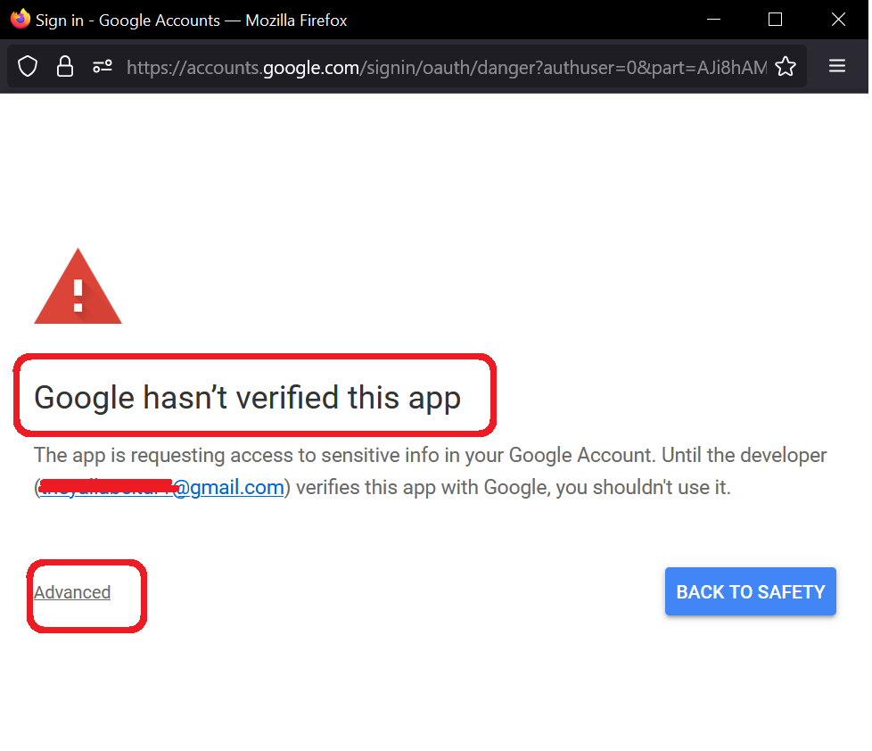
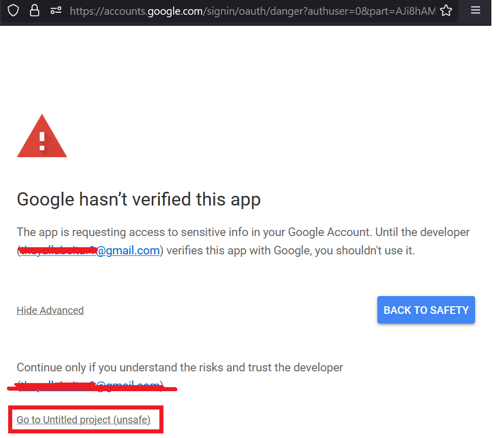

<h1>Project Name</h1>
Keep Your Gmail Inbox Fresh Using Google 


<h2>Project Description</h2>
This project provides a Google Apps Script solution for keeping your Gmail inbox fresh. 
It also includes a comparison to a old solution that did not use Google Apps Script.


<h2>Motivation</h2>
Following the basics of Google Apps Script <a href='#ref1'>[1]</a>, I want to use it to
 keep my Gmail inbox fresh by moving emails older than 24 hours to INBOX-old.

<h2>Installation</h2>
No installation is required, but you do need a Gmail account.

<h2>Usage</h2>
Follow these steps:
<ul>
  <li>Create a new project</li>
  <li>Add a function to keep the inbox fresh</li>
  <li>Run the function manually to test it</li>
  <li>Add a trigger</li>
</ul>

These steps are similar to <a href='#ref1'>[1]</a>. Additionally, you need to 
approve the app following the function run and may need to use the debug screen.


<h2>Technologies Used</h2>
Google apps script

<h2>Code Structure</h2>

```js
function moveOldEmails() {
  try {
    let oldInboxLabel = GmailApp.getUserLabelByName("INBOX-old");
    if (!oldInboxLabel) {
      oldInboxLabel = GmailApp.createLabel("INBOX-old");
    }

    const now = new Date();
    const twentyFourHoursAgo = new Date(now.getTime() - 24 * 60 * 60 * 1000);

    const threads = GmailApp.getInboxThreads();

    for (let thread of threads) {
      if (!thread) continue;

      const messages = thread.getMessages();

      if (messages.length === 0) continue;

      const newestMessage = messages[messages.length - 1];

      if (newestMessage.getDate() < twentyFourHoursAgo) {
        thread.addLabel(oldInboxLabel);
        thread.moveToArchive();
      }
    }
  } catch (e) {
    Logger.log('Error: ' + e.toString());
  }
}
```


<h2>Demo</h2>
Here we'll walk you through the setup and execution of a Google Apps Script project using visual aids

<h3>Dashboard</h3> The dashboard of the Google Apps Script appears in this image. 
You can see the created project 'fresh-inbox' circled in red.


<h3>Trigger</h3> The created trigger appears (after creation) in the following image.


The function <code>moveOldEmails</code> is triggered once every 24 hours, 
as shown in the following image.


<h3>First Run</h3> The first click on the Run button will require you to follow these steps, as shown in the images:

<strong>Step 1 - Review permission</strong> 


<strong>Step 2 - Choose an account</strong> 


<strong>Step 3 - Continue to advanced</strong> 


<strong>Step 4 - Go to unsafe</strong> 


<strong>Step 5 - Trust the project</strong> 


<strong>Step 6 - Now you can run the function</strong> 


<h3>Executions</h3> 
The executions of <code>moveOldEmails</code> appear in a red circle in the following image. 
You can see one with type Editor (i.e., executed using the Run button) and two 
executions with type Time-Driven, which were invoked automatically using the trigger.


<h3>Debug</h3> 
When you have a code issue, you can debug it by clicking on the debug button, 
shown in the image.


<h2>Compare New Solution to Old</h2>
Here's a quick comparison of the old and new solutions, highlighting key improvements.

<h3>Old Solution</h3> 
The design components are:
<ul>
  <li>Gmail API</li>
  <li>Linux cron</li>
  <li>Long code</li> 
  <li>Digital Ocean droplet</li>
  <li>Google Cloud project: authentication, credentials, permissions, enable API</li> 
  <li>GitHub project</li>
  <li>Deploy script</li>
</ul>

<h3>Current Solution</h3> 
The design components: Google Apps Script with 30 lines of code.

<h3>Comparison</h3> 
In this use case, Google Apps Script is superior:
<ul>
  <li>Cost - None for the new solution, $6 per month for the old solution</li>
  <li>Complexity - Very simple for Google Apps Script, complicated (many components involved) for the old solution</li>
</ul>

<h2>Points of Interest</h2> 
<ul>
  <li>You need to approve the app because it requires permission. Ensure you trust the script before granting permissions, as it interacts with your Gmail account.</li>
</ul>

<h2>References</h2> 
<ul>
  <li id='ref1'><a href='https://youtu.be/kTRhDpy1dSU'>Getting Started with Google Apps Script</a></li>
</ul>

