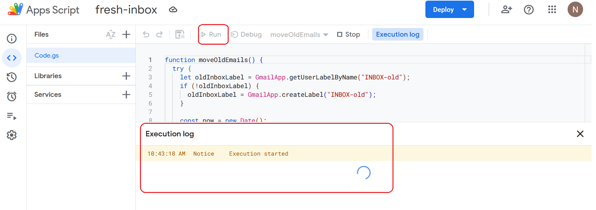

<h1>Project Name</h1>
Keep fresh gmail inbox using google apps script


<h2>Project Description</h2>
This project provide a google apps script solution for keeping your gmail inbox fresh. It provide also comparison to the prevouse solution not using google apps script

<h2>Motivation</h2>
Following the basics of google apps script <a href='#ref1'>[1]</a> i want now to use it to make my gmail inbox fresh - 24+ hours old email are move to INBOX-old

<h2>Installation</h2>
No installation is required, but you do need a Gmail account.


<h2>Usage</h2>
Follow these steps:
<ul>
<li>Create a new project</li>
<li>Add a function to make the inbox fresh</li>
<li>Run the function manually to test it</li>
<li>Add a trigger</li>
<ul>

These step are similiar to <a href='#ref1'>[1]</a>

On top of these steps you need to approve the app following the function run and may be use the debug screen


<h2>Technologies Used</h2>
Google apps script

<h2>Code Structure</h2>

```js
function moveOldEmails() {
  try {
    let oldInboxLabel = GmailApp.getUserLabelByName("INBOX-old");
    if (!oldInboxLabel) {
      oldInboxLabel = GmailApp.createLabel("INBOX-old");
    }

    const now = new Date();
    const twentyFourHoursAgo = new Date(now.getTime() - 24 * 60 * 60 * 1000);

    const threads = GmailApp.getInboxThreads();

    for (let thread of threads) {
      if (!thread) continue;

      const messages = thread.getMessages();

      if (messages.length === 0) continue;

      const newestMessage = messages[messages.length - 1];

      if (newestMessage.getDate() < twentyFourHoursAgo) {
        thread.addLabel(oldInboxLabel);
        thread.moveToArchive();
      }
    }
  } catch (e) {
    Logger.log('Error: ' + e.toString());
  }
}
```

<h2>Demo</h2>

<h3>Dashboard</h3>
The dashboard of the google apps script appears in this image. You can see the created project 'fresh-inbox' circled in red


<h3>Trigger</h3>
The created trigger appear in the folloing image


The trigger details are once every 24 hours as shown in the following image


<h3>First run</h3>

First click on run button will require you for these steps

step 1 - review permission


step 2 - choose an account


step 3 - contunue to advanced


step 4 - go to unsafe


step 5 - trust the project


step 6 - now you can run the function



<h3>executions</h3>

The executions of moveOldEmails appear in red circle in the following image. You can see one emarked Editor i.e. exected using Run button and two executions marked Time-Driven whichwere invoked automatically using the trigger


<h3>debug</h3>
When you have code issue you can debug it by clicking on the debug button - shown in the image


<h2>compare new solution to old</h2>

<h3>prevouse solution</h3>
the design components are:
<ul>
<li>gmail api</li>
 <li>linux cron </li>
 <li>long code</li> 
 <li>digital ocean droplet </li>
 <li>google cloud project : authentication , credentials , permissions , enable api</li> 
<li>github project</li>
<li>deploy script</li>
</ul>

<h3>current solution</h3>
the design components: google apps script with 30 lines of code

<h3>comparison</h3>
in this this use case the appscript is supirior
<ul>
<li>cost - none for new 6$ per month for prev</li>
<li>complexity - very simple for google apps sceipt , complicated (many components invokved) for prev</li>
</ul>

<h2>Points of interest</h2>
<ul>
    <li>you need to aprovw the app because it requires permission</li>
</ul>


<h2>References</h2>
<ul>
    <li id='ref1'><a href='https://youtu.be/kTRhDpy1dSU'> Getting Started with Google Apps Script</a></li>
</ul>

